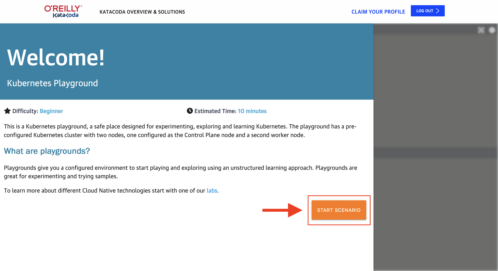
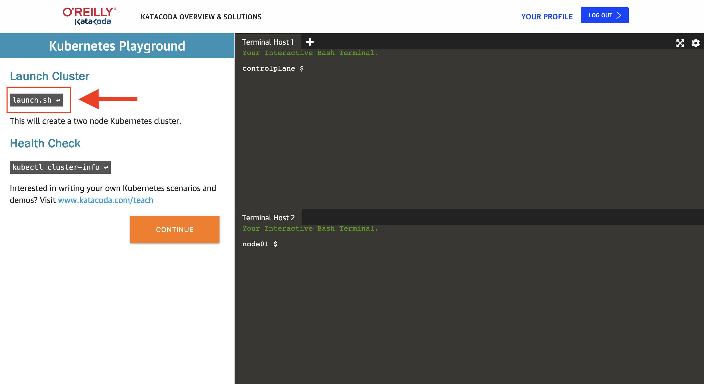
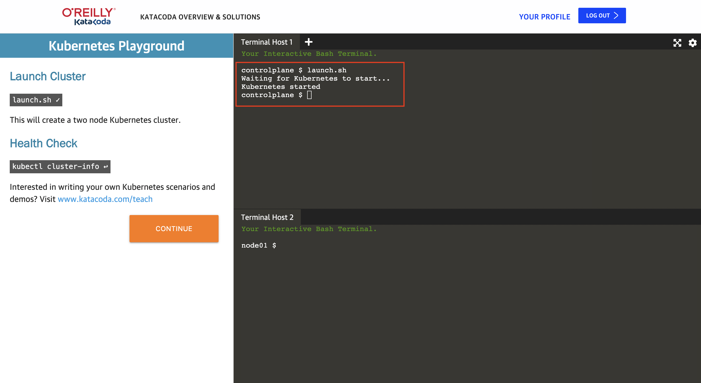
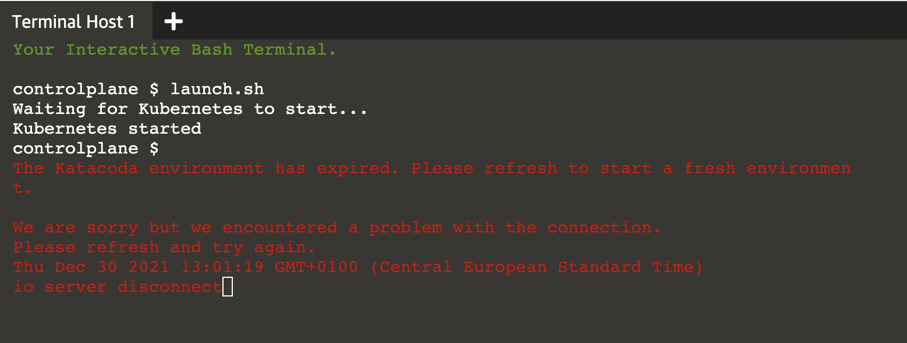

# Užitočné info

- [Naklonovanie tohto repozitára](#naklonovanie)
- [Prostredie pre praktické ukážky](#prostredie)
- [Zmena adresára cez príkazový riadok](#zmena-adresara)
- [Čo keď mi vyprší prostredie na Katacode?](#vyprsi-prostredie)

## Naklonovanie tohto repozitára

Spusti príkaz `git clone https://github.com/alicak/czechitas-cloud-deployment.git`.

## Prostredie pre praktické ukážky

Budeme používať online prostredie **Kubernetes Playground** od **Katacoda**: https://www.katacoda.com/courses/kubernetes/playground

Potrebné kroky:

1. Registrácia. Stránka vyžaduje bezplatnú registráciu.

2. Klik na "Start scenario".

3. Klik na "launch.sh".

V termináli sa potom zobrazí hláška "Kubernetes started".

### Lokálna inštalácia (pre odvážnych)

Nasledujúce inštrukcie sú pre tých, ktorí by chceli vedieť, ako sa môžu s Dockerom a Kubernetes hrať aj priamo na svojom počítači. **Pre meetup to ale nie je potrebné -- Katacoda nám bude pre všetky ukážky bohato stačiť.**

Na lokálne spustenie je potrebná inštalácia 3 alebo 4 nástrojov:
- [Docker](https://www.docker.com/) - nástroj pre prácu s kontajnermi
- [kubectl](https://kubernetes.io/docs/reference/kubectl/) - nástroj pre prácu s Kubernetes clusterom cez príkazový riadok
- [k3d](https://k3d.io/v5.2.2/) - lokálny Kubernetes cluster (pod kapotou používa Docker)
- [Lens](https://k8slens.dev) (nepovinné, grafická nadstavba nad kubectl) - nástroj pre prácu s Kubernetes clusterom cez grafické rozhranie

Hlavne inštalácia Dockeru na počítač s Windows môže byť náročnejšia, lebo vyžaduje zapnutú virtualizáciu, a tá sa zapína cez zmenu nastavenia v BIOS-e. Taktiež funguje len na Windows 10 a vyšších.

Potrebné kroky:

1. Nainštalovať Docker: https://docs.docker.com/get-docker/

2. Nainštalovať kubectl: https://kubernetes.io/docs/tasks/tools/#kubectl

3. Nainštalovať k3d: https://k3d.io/v5.2.2/#installation

4. Vytvoriť cluster cez k3d: https://k3d.io/v5.2.2/#quick-start

5. Nainštalovať Lens: https://docs.k8slens.dev/main/getting-started/

6. Vytvoriť si účet pre Lens.

7. Pridať cluster do Lens.

## Zmena adresára cez príkazový riadok

Na zmenu adresára, v ktorom sa nachádzame, používame príkaz `cd`.

`cd ..` - presuň ma do adresára o úroveň vyššie

`cd demo3-pods` - presuň ma do adresára demo3-pods (ktorý sa nachádza v mojom súčasnom adresári)

*Príklad 1:*

Nachádzam sa v adresári `[nieco]/czechitas-cloud-deployment/demo2-docker`. 

Ak zadám príkaz `cd ..`, presuniem sa do adresára `[nieco]/czechitas-cloud-deployment` (o jeden vyššie).

*Príklad 2:*

Nachádzam sa v adresári `[nieco]/czechitas-cloud-deployment`.

Ak zadám príkaz `cd demo3-pods`, presuniem sa do adresára `[nieco]/czechitas-cloud-deployment/demo3-pods` (o jeden nižšie).

## Čo keď mi vyprší prostredie na Katacode?

Nemalo by sa to stať, ale keby náhodou... 

1. Refreshni stránku s Katacodou.

2. Znovu urob kroky 2 a 3 z [návodu vyššie](#prostredie) (klik na "Start scenario" a "launch.sh").

3. Znovu si naklonuj tento repozitár (`git clone https://github.com/alicak/czechitas-cloud-deployment.git`). 

4. Prejdi do adresára s aktuálnym demom (`cd czechitas-cloud-deployment/[nazov adresara s demom]`)

Ak sa to stane počas iného dema než 5, 7 alebo 8, tak to je všetko. 

Inak ešte k tomu spusti aj príkazy podľa inštrukcií nižšie. 

**Počas dema 5**:

Potrebujeme znovu vyrobiť deployment z dema 4.

1. `cd ../demo4-deployments`
2. `kubectl apply -f numbers-deployment.yaml`
3. `cd ../demo5-deployments2`

**Počas dema 7**:

Potrebujeme znovu vyrobiť deployment z dema 5 a prípadne aj service, ktorú sme vyrobili v tomto deme.

1. `cd ../demo5-deployments2`
2. `kubectl apply -f auth-deployment.yaml`
3. `cd ../demo7-services`
4. Ak sme už vyrábali v tomto deme service auth-service, tak aj `kubectl apply -f auth-service.yaml`

**Počas dema 8**:

Potrebujeme znovu vyrobiť deploymenty z dema 5 a dema 7 a service z dema 7.

1. `cd ../demo5-deployments2`
2. `kubectl apply -f auth-deployment.yaml`
3. `cd ../demo7-services`
4. `kubectl apply -f auth-service.yaml`
5. `kubectl apply -f numbers-deployment-2.yaml`
6. `cd ../demo8-services2`

